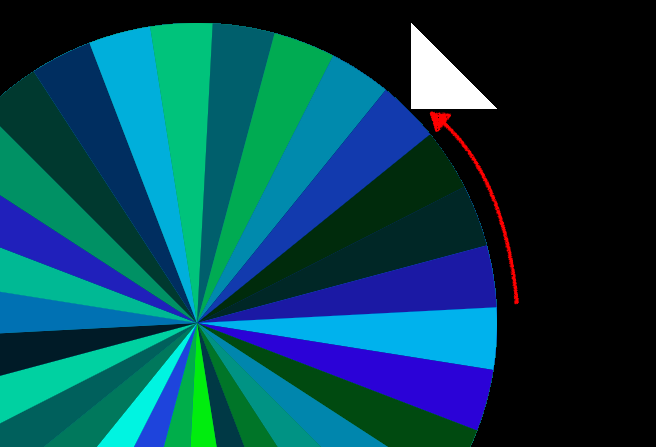

# Stuff Picker

Live: [Stuff Picker](https://fuchssarahe.github.io/stuff_picker/)

## The Vision

The stuff picker offers user activity suggestions based on that person's mood. Upon generating a suggestion, the user has an option to seek out additional information on performing that activity nearby.

The project has a few main components - filters, a picker, a spinner, and results. Filters determine which activities are available to the picker, which in turn selects a random result. The spinner is solely used to provide a visual component to the selection process.

## Tools
- JavaScript
- Canvas
- DOM API
- Google Maps API
- Navigator/geolcation web API

## The Interesting Things
### Spinner
The spinner in the stuff picker is built using canvas. While creating the content of the canvas is not difficult, the tricky bit comes from passing information from the canvas to the results. This excludes any information about the activity selected - simply because the spinner doesn't need to know what activities are available in order to select a position on the wheel.

To do this most simply, a particular color is passed from the spinner to results. This color actually determined by the color used on the spinner last. By generating the spinner such that the last color used is lined up with the arrow, the canvas has access to the value of this color. This value can then be passed around to the other functions.



The picker then displays a random activity once the spinner's animation is complete.

### Gelocation
The stuff picker integrates with the navigator/gelocation API. As users must allow or disallow a website access to their location, a website must necessarily be able to respond appropriately in either circumstance.

However, if a user does not update their permissions, it is impossible to either find success or failure in obtaining the user's location. To combat this issue, the Stuff Picker sets an asynchronous function which redirects the user if the gelocation request is taking too long or if the user has not responded to the request for access to their location.

This improvement to user experience was tricky to get quite right, as timing is everything. Ultimately, the coverage of edge cases is worth the more complicated response cycle.

```JavaScript
// lib/stuff_picker.js

function redirectToGoogleSearch(picker) {
  if ('geolocation' in navigator) {
    // asynchronous function which redirects if user does not respond to permissions prompt
    const timeout = setTimeout(() => window.location = `http://google.com/search?q=` + picker.result, 8000)
    navigator.geolocation.getCurrentPosition( position => {
      // clears timeout if location has been successfully obtained
      clearTimeout(timeout);
      const geocoder = new google.maps.Geocoder();
      const latlng = new google.maps.LatLng(position.coords.latitude, position.coords.longitude);

      geocoder.geocode({'latLng': latlng}, function(results, status) {
        if (status == google.maps.GeocoderStatus.OK) {
          const address = results[0].formatted_address;
          window.location = `http://google.com/search?q=${picker.result}+near+${address}`;
        } else {
          window.location = `http://google.com/search?q=` + picker.result;
        }
      });
    }, () => window.location = `http://google.com/search?q=` + picker.result)
  } else {
    window.location = `http://google.com/search?q=` + picker.result
  }
};
```

## The Future
Currently, this project has all of the primary functionality that it will have. In future, I may take the time to make the site responsive or mobile friendly. At it's current state, however, much more functionality won't make the project better. The stuff picker is meant to be simple, clean, and fill a unique need.
